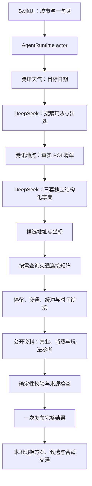

# 手机端 Agent 架构

规划在 iPhone 的 Swift Runtime 中协调，模型推理运行在远端 DeepSeek API。没有依赖桌面 Codex SDK 或本地模型进程。

## 核心模块

| 模块 | 职责 |
| --- | --- |
| `AgentContracts.swift` | 意图、候选、路线、证据、交通筛选和事件协议 |
| `AgentRuntime.swift` | 有界编排、重试、取消、Checkpoint 与原子发布 |
| `TripVerifier.swift` | 天气日期与有效期、地点完整性、路线矩阵、停留衔接等确定性门禁 |
| `DeepSeekResponsesPlanningAdapter.swift` | Responses 接口和 JSON Schema 结构化规划 |
| `DiscoveryService.swift` | 联网搜索、玩法归纳与来源绑定 |
| `TencentTravelAPI.swift` | 地点、路线、天气解析与限速 |
| `PlaceResearchService.swift` | 可读页面、同店匹配、原文证据、样本统计 |
| `ReferenceLibrary.swift` | 参考资料的本地保存、去重与管理 |
| `MobileAppModel` | 预构建展示数据、选择记忆与交通晚到提示 |

## 为什么切换不用再生成

每套有 3～5 个体验节点，每个节点三个候选。先准备相邻节点之间的连接矩阵，而不枚举所有完整路径。每套需要 24／33／42 条连接，分别覆盖 27／81／243 种地点组合。

交通先查询步行：小于 8 分钟即完成；否则查询骑行和驾车。超过 15 分钟的步行不进入选项。默认展示一种推荐方式，其他合适方式藏在小菜单里。切换读取现有数据；若当前方式影响后续到达时间，只计算并提示影响，不在后台补生成。

## 证据边界

地图距离和耗时是供应商估算，驾车取查询时路况，不代表未来出发时刻的精确路况。帖子与历史评论不等于当前营业事实；有效样本不足时不能声称已做 3～5 篇统计。订位入口、营业时间、人均价格与菜品价格均保留来源和不确定性。

Checkpoint 当前仅在内存中；断点恢复、跨设备同步、完整多日旅行与自动完成预订尚未实现。
