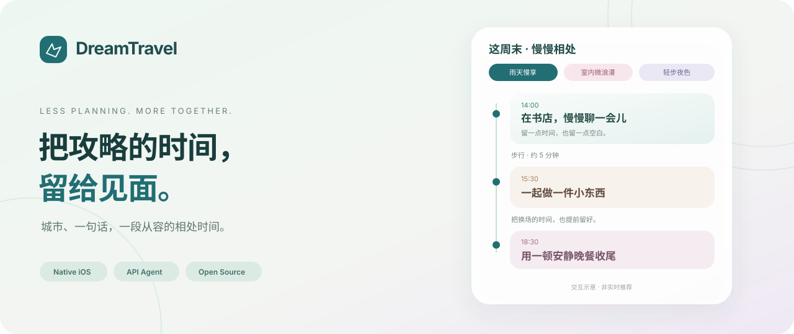

<p align="center">
  
</p>

<p align="center">
  <strong>一个轻量的 iPhone 约会与旅行规划助手。</strong><br />
  告诉它在哪见面，把天气、地点和交通交给 Agent，留下一段完整、从容的相处时间。
</p>

<p align="center">
  
  
  
  
  <a href="LICENSE"></a>
</p>

<p align="center">
  <a href="#快速开始">快速开始</a> ·
  <a href="#体验设计">体验设计</a> ·
  <a href="Documentation/Architecture.md">Agent 架构</a> ·
  <a href="TravelProviderSetup.md">API 配置</a> ·
  <a href="CONTRIBUTING.md">参与贡献</a>
</p>

---

## 为相处留出余地

忙碌了一天，不想再做一晚上的攻略。DreamTravel 从「这周末，我们在哪见面」开始，结合天气、真实地点、交通与公开参考，整理几种不同的约会体验。

**目前是可运行的原生 iOS 开发原型（v0.16.1），重点支持城市内半日约会。** 不是已经上架的完整旅游预订产品；多日旅行、酒店库存和自动预订仍是后续方向。

## 体验设计

| 少一点操作 | 多一点准备 |
| --- | --- |
| **城市 + 一句话** | 首页保留必要条件，自由描述可选填 |
| **三套不同的安排** | 每套独立候选池，安排 3～5 个体验节点 |
| **每站轻松换一个** | 独立三选一窗口，候选及前后交通提前准备 |
| **交通只显示一个推荐** | 有合适备选才出现小图标，切换不用等待生成 |
| **计划有自己的气氛** | 12 套预设视觉，按标题与内容配色；动效可关闭 |
| **看到的是完整行程** | 会合、交通、停留、留白与返程连成一条时间线 |

**交通也应当轻量：** 步行少于 8 分钟，只提供步行；8～15 分钟可有其他备选；超过 15 分钟排除步行。地图未返回的时间不靠比例换算。切换后赶不上下一站，会明确提示。

## 数据有出处，未知有边界

- **先看天气再规划**：腾讯提供目标日期的温度、湿度和天气，再交给模型组织体验。
- **真实地点与路线**：地址、坐标、步行／骑行／驾车耗时来自腾讯位置服务。
- **主动发现新玩法**：调用搜索能力整理公开参考，保存出处供查看和复用。
- **怎么点、怎么玩**：从可读且匹配同一家店的资料中提取建议、人民币消费参考和预约信息；样本不足会说明。
- **预约交给平台**：有有效链接时打开 App 内网页；只有平台入口时明确标识，不冒充商家预订页。
- **自己的灵感库**：管理参考条目，支持编辑、停用、删除，以及关闭自动积累和生成时引用。

小红书、抖音、大众点评等平台的完整内容覆盖**不作保证**。不能读取的帖子不算有效样本，历史记录也不等于当天营业或有预约名额。

## 快速开始

### 1. 用 Xcode 运行

准备一台 Mac、支持 Swift 6 的 Xcode 和 iPhone 模拟器。工程最低运行版本为 iOS 17；当前开发环境使用 Xcode 26.6。

```bash
git clone https://github.com/HelloHaoWu/DreamTravel.git
cd DreamTravel
open DreamTravelMobile.xcodeproj
```

选择 **DreamTravelMobile** Scheme 和 iPhone 模拟器，按 **⌘R**。真机运行需在 **Signing & Capabilities** 中选择自己的开发团队和可用 Bundle ID。

没有 Key 也可以先进入明确标注的演示行程。

### 2. 配置自己的 API Key

打开 App 的设置：

| 服务 | 配置方式 | 用途 |
| --- | --- | --- |
| DeepSeek | 「模型连接」中输入并验证自己的 Key | 结构化规划、联网搜索与整理 |
| 腾讯位置服务 | 「我的腾讯位置服务」中输入并验证自己的 WebService Key | 地点、路线与天气 |

模型连接默认请求 `deepseek-v4-flash`，运行时以供应商实际返回、账号可用的模型为准。规划和研究分别使用 Responses 与 Anthropic 兼容接口；仅支持 Chat Completions 的服务不能直接替代全部能力。

设置内提供腾讯官方快速注册页入口。**本仓库没有预填 Key，也不附带 API 额度**；免费额度、接口权限和计费以自己的服务商账号为准。

凭据保存在设备 Keychain。详细步骤见 [API 配置](TravelProviderSetup.md)，数据去向见 [隐私说明](Documentation/Privacy.md)。

### 3. 安排这次见面

输入城市，按需补充「少走路」「想一起做点东西」等描述，点击 **替我安排**。生成中可取消；全部候选和合适交通准备完毕后，才一次性展示完整结果。

> 真实生成会使用外部 API，耗时与费用取决于候选数量、地点研究、搜索和重试。城市半日行程的三套方案合计 72～126 条连接，按短步行比例需要约 72～378 次路线查询；另有地点、天气与模型调用。

## Agent 如何工作


Swift `actor` 在手机端协调工具与远端模型，`AsyncStream` 向 SwiftUI 提供进度及完成事件。来源、日期、有效期、路线完整性和时间衔接由代码校验。失败或取消不会发布半份结果，也不会覆盖上一份完整行程。

详见 [架构与证据边界](Documentation/Architecture.md)。

## 开发与验证

应用没有第三方 Swift 包依赖，使用 SwiftUI、Foundation、MapKit、Security 和 SafariServices 等系统框架。

```bash
# 离线 Fixture：不调用付费 API
zsh scripts/check-travel-pipeline.sh
zsh scripts/check-plan-themes.sh
zsh scripts/check-http-recovery.sh

# iPhone 模拟器构建
xcodebuild -project DreamTravelMobile.xcodeproj \
  -scheme DreamTravelMobile -sdk iphonesimulator \
  -destination 'generic/platform=iOS Simulator' \
  -derivedDataPath /tmp/DreamTravelDerivedData \
  CODE_SIGNING_ALLOWED=NO build

# 暂存修改后，检查将进入公开仓库的内容
zsh scripts/check-publication.sh
```

回归覆盖 3／4／5 站的 351 种候选组合、交通边界、完整发布、取消、网络恢复、证据引用和资料库行为。Fixture 通过不代表某个外部接口当前可用；真实联调单独配置，参见 [配置文档](TravelProviderSetup.md)。

```text
.
├── DreamTravelMobile/            # 当前 iPhone App
│   ├── Agent/                    # 编排、协议、调度与校验
│   ├── Features/                 # 规划和连接状态
│   ├── Services/                 # 模型、地图、研究与参考库
│   ├── Models/                   # 展示模型与选择记忆
│   ├── Style/                    # 12 套视觉预设
│   └── Views/                    # SwiftUI 界面
├── DreamTravelMobile.xcodeproj/  # 原生 iOS 工程
├── Tests/                        # 无真实凭据的回归测试
├── Tools/                        # 本地开发与发布检查
├── scripts/                      # 构建与验证入口
├── Documentation/               # 架构、隐私及自制展示素材
└── Sources/DreamTravelApp/       # 早期 macOS 交互原型
```

<details>
<summary>运行早期 macOS 原型</summary>

```bash
swift run DreamTravelApp
# 或打包本地 .app
zsh scripts/build-app.sh
```

这部分保留早期交互验证，功能与当前 iOS App 不对等；新功能以 iOS 工程为准。

</details>

## 接下来

- [ ] 提高公开参考的可读率、同店匹配和可追溯性。
- [ ] 增加更多交通、雨天及弱网场景的真机验证。
- [ ] 将用户主动反馈沉淀为可查看、可删除的经验。
- [ ] 扩展多日旅行、持久化恢复与更完整的预约衔接。

欢迎通过 Issue 讨论可复现的问题，通过 PR 改善交互和实现。提交前请阅读 [贡献指南](CONTRIBUTING.md) 和 [安全说明](SECURITY.md)。

## 许可证

[MIT](LICENSE) · DreamTravel contributors。代码及自制文档素材开放使用；第三方平台内容与数据遵循其自身条款。
