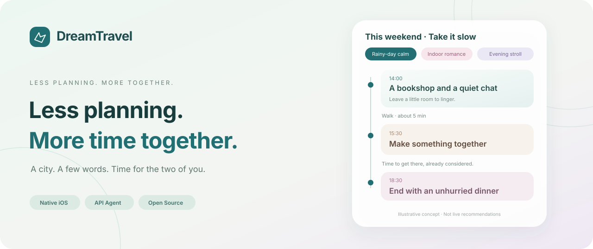
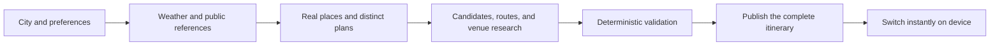

<p align="center">
  
</p>

<p align="center">
  <strong>A lightweight iPhone companion for thoughtful dates and city trips.</strong><br />
  Tell it where you want to meet. Let the agent work through the weather, places, and routes, so you can focus on being together.
</p>

<p align="center">
  <strong>English</strong> · <a href="README.zh-CN.md">简体中文</a>
</p>

<p align="center">
  
  
  
  
  <a href="LICENSE"></a>
</p>

<p align="center">
  <a href="#demo">Demo</a> ·
  <a href="#using-the-iphone-app">Using the app</a> ·
  <a href="#designed-to-feel-simple">Experience</a> ·
  <a href="#how-the-agent-works">Agent architecture</a> ·
  <a href="#2-connect-your-own-api-keys">API setup</a> ·
  <a href="#whats-next">Contribute</a>
</p>

---

## Make room for time together

After a long day, planning a date should not take another evening. DreamTravel starts with a simple question: “Where shall we meet this weekend?” It combines weather, real places, routes, and public references into a few distinct ways to spend time together.

**DreamTravel is an iPhone app: everyday use starts by opening the app.** The current native iOS development preview (v0.16.1) focuses on half-day dates within a city. There is no public App Store release, TestFlight invitation, or installable download yet. Xcode is used for development and debugging; multi-day trips, hotel availability, and automated booking are future work.

The current app interface and demo are in Chinese, and its data integrations focus on mainland China. This English README does not imply that the app has an English localization. Detailed supporting documents are currently in Chinese.

## Demo

[**▶ Watch / download Demo 1 · iPhone app walkthrough**](https://github.com/HelloHaoWu/DreamTravel/releases/download/demo-1/DreamTravel-Demo1.mp4)

Approximately **11 minutes 23 seconds**, with no audio. The recording preserves the actual generation wait in this run. Skip to **around 08:00** to see the itinerary, alternative choices, and theme switching. This is simulator footage, not a benchmark of device performance or typical generation time.

[Video release page and notes →](https://github.com/HelloHaoWu/DreamTravel/releases/tag/demo-1)

## Designed to feel simple

| Less to do | More prepared for you |
| --- | --- |
| **A city and an optional sentence** | Only essential inputs on the home screen |
| **Three distinct plans** | Separate candidate pools, with 3–5 stops per plan |
| **An easy change at each stop** | A dedicated three-choice sheet, with candidates and connecting routes prepared in advance |
| **One recommended way to get there** | A small switch control appears only when suitable alternatives exist; no regeneration wait |
| **A mood for each plan** | 12 visual presets matched to the title and content, with optional animations |
| **One continuous itinerary** | Meeting up, travel, visits, breaks, and the return journey share a timeline |

**Travel choices stay simple too:** under 8 minutes on foot, only walking is offered; from 8 to 15 minutes, other suitable options may appear; over 15 minutes, walking is excluded. Missing route times are not estimated by scaling another transport mode. If a change makes the next stop too tight, the app flags it.

## Sources where available, uncertainty where needed

- **Weather before planning:** Tencent supplies temperature, humidity, and weather for the target date before the model puts the experience together.
- **Real places and routes:** addresses, coordinates, and walking, cycling, and driving times come from Tencent Location Service.
- **Fresh ideas through search:** the agent gathers public references and keeps their sources for review and reuse.
- **What to order and what to do:** readable sources matched to the same venue inform recommendations, spending estimates in RMB, and reservation details. Insufficient evidence is labeled.
- **Booking through the provider:** a valid booking link opens in an in-app web view. A general platform entry point is labeled as such, rather than presented as a venue-specific booking page.
- **A personal inspiration library:** edit, disable, or delete saved references, and turn off automatic collection or their use in future plans.

Full access to content on Xiaohongshu (RedNote), Douyin, Dianping, and similar platforms is **not guaranteed**. Unreadable posts do not count as valid evidence, and past visitor reports do not establish today's opening hours or reservation availability.

## Using the iPhone app

This describes the in-app workflow. For now, preview it in the demo above; public installation and distribution are planned for a later release. Developers can use the [local development instructions](#development-and-validation) below.

### 1. Open DreamTravel

Open the app from the iPhone home screen and go to **Start (开始)**. A clearly labeled demo itinerary is available without API keys.

### 2. Connect your own API keys

Open the app's settings:

| Service | Where to configure it | Purpose |
| --- | --- | --- |
| DeepSeek | Enter and validate your key in **Model Connection (模型连接)** | Structured planning, web search, and synthesis |
| Tencent Location Service | Enter and validate your WebService key in **My Tencent Location Service (我的腾讯位置服务)** | Places, routes, and weather |

The default requested model is `deepseek-v4-flash`; the model actually available depends on the provider response and your account. Planning uses a Responses-compatible interface, while research uses an Anthropic-compatible interface. A service that only supports Chat Completions cannot directly replace all of these capabilities.

Settings includes a shortcut to Tencent's official quick registration page. **No prefilled keys or API credits are included in this repository.** Free quotas, endpoint permissions, and billing depend on your own provider account.

Credentials are stored in the device Keychain. See [API setup](TravelProviderSetup.md) and [privacy and data flows](Documentation/Privacy.md) for details (currently in Chinese).

### 3. Plan your time together

Enter a city, optionally add something like “less walking” or “make something together,” and tap **Plan for me (替我安排)**. You can cancel during generation. The complete result appears only after all candidates and suitable connecting routes are ready.

> Real generation calls external APIs. Time and cost depend on candidate count, venue research, search, and retries. Across three half-day plans, the app prepares 72–126 connections, requiring roughly 72–378 route queries depending on how many short walks qualify for walking-only treatment. Place, weather, and model calls are additional.

## How the agent works



Swift `actor` types coordinate tools and remote models on the phone. `AsyncStream` delivers progress and completion events to SwiftUI. Code checks sources, dates, freshness, route completeness, and schedule consistency. A failed or canceled run does not publish a partial plan or overwrite the last complete itinerary.

See [architecture and evidence boundaries](Documentation/Architecture.md) for more detail (currently in Chinese).

## Development and validation

The app has no third-party Swift package dependencies. It uses system frameworks including SwiftUI, Foundation, MapKit, Security, and SafariServices.

### Local development

You need a Mac, Xcode with Swift 6 support, and an iPhone simulator. The minimum deployment target is iOS 17; the current development environment uses Xcode 26.6.

```bash
git clone https://github.com/HelloHaoWu/DreamTravel.git
cd DreamTravel
open DreamTravelMobile.xcodeproj
```

Select the **DreamTravelMobile** scheme and an iPhone simulator, then press **⌘R** to debug. For a physical device, choose your own development team and an available bundle identifier under **Signing & Capabilities**.

### Build and check

```bash
# Offline fixtures: no paid API calls
zsh scripts/check-travel-pipeline.sh
zsh scripts/check-plan-themes.sh
zsh scripts/check-http-recovery.sh

# Build for the iPhone simulator
xcodebuild -project DreamTravelMobile.xcodeproj \
  -scheme DreamTravelMobile -sdk iphonesimulator \
  -destination 'generic/platform=iOS Simulator' \
  -derivedDataPath /tmp/DreamTravelDerivedData \
  CODE_SIGNING_ALLOWED=NO build

# After staging changes, check what will enter the public repository
zsh scripts/check-publication.sh
```

Regression coverage includes 351 candidate combinations across 3-, 4-, and 5-stop plans, transport thresholds, complete-result publication, cancellation, network recovery, evidence references, and library behavior. Passing fixtures does not establish that an external endpoint is currently available. Live integration requires separate configuration; see [API setup](TravelProviderSetup.md).

```text
.
├── DreamTravelMobile/            # Current iPhone app
│   ├── Agent/                    # Orchestration, protocols, scheduling, validation
│   ├── Features/                 # Planning and connection state
│   ├── Services/                 # Models, maps, research, reference library
│   ├── Models/                   # Presentation models and remembered selections
│   ├── Style/                    # 12 visual presets
│   └── Views/                    # SwiftUI views
├── DreamTravelMobile.xcodeproj/  # Native iOS project
├── Tests/                        # Regression tests without real credentials
├── Tools/                        # Local development and publication checks
├── scripts/                      # Build and validation entry points
├── Documentation/               # Architecture, privacy, original visual assets
└── Sources/DreamTravelApp/       # Early macOS interaction prototype
```

<details>
<summary>Run the early macOS prototype</summary>

```bash
swift run DreamTravelApp
# Or package a local .app
zsh scripts/build-app.sh
```

This preserves the early interaction prototype. It does not have feature parity with the current iOS app; new features target the iOS project.

</details>

## What's next

- [ ] Refine the experience on physical devices and prepare iPhone app test distribution and installation.
- [ ] Improve public-source readability, venue matching, and traceability.
- [ ] Validate more transport, rainy-day, and unreliable-network scenarios on real devices.
- [ ] Turn explicit user feedback into experience records that users can inspect and delete.
- [ ] Expand to multi-day trips, persistent recovery, and more complete booking handoffs.

Issues with reproducible steps and pull requests improving the experience or implementation are welcome. Please read the [contribution guide](CONTRIBUTING.md) and [security policy](SECURITY.md) before submitting (currently in Chinese).

## License

[MIT](LICENSE) · DreamTravel contributors. The code and original documentation assets are open source; third-party content and data remain subject to their respective terms.
